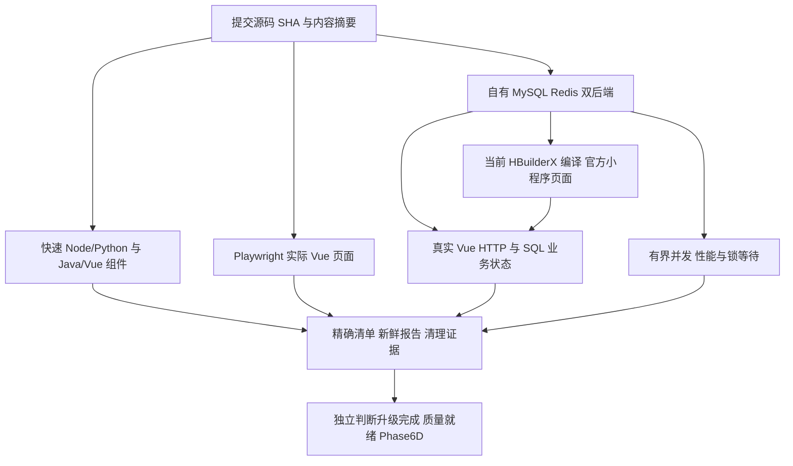

# 目标测试架构与运行矩阵

统一调度继续使用 `tests/quality/run.py`。执行证据按层区分，业务断言与构建成功分别报告。新模式的 `status` 为 PASSED/FAILED/SKIPPED/BLOCKED/NOT_RUN/INCONCLUSIVE；保留旧 `result=PASS/FAIL/NOT_READY` 兼容字段。未执行、跳过、环境缺失、变更源码均不能生成通过证书。

| 作业 | 执行环境 | 触发/成本 | 内容 |
|---|---|---|---|
| quality | 普通Linux Java17/Node20/Python3.11/pnpm8.15.9 | 每PR | 55模块构建、快速回归、所有普通Java、JaCoCo、Vue组件/V8、前端变异、Vue构建/类型、安全差异检查 |
| browser-smoke | 普通Linux Node22+Chromium | 每PR、独立15分钟上限 | 5项实际Vue页面；API替身显式标注 |
| controlled-dependencies | 普通Linux Docker/Node22 | 每PR、独立60分钟上限 | 自有MySQL/Redis/TLS、双JVM HTTP、实际Vue/Spring/SQL链路、清理 |
| high-risk-mutations | 普通Linux Java17 | 每PR仅3项；手动运行28项 | 基线必须通过；仅实际断言失败计KILLED；初始化错误为INCONCLUSIVE |
| 官方小程序页面 | 受控macOS + HBuilderX + 微信开发者工具 | 本地显式MINI-PAGES | 当前编译、页面真实操作、故障后相同key重试、SQL/Vue确认、失败截图和私有日志 |
| 性能 | 受控自有双后端 | 本地显式PERFORMANCE | 12并发×10请求×2场景；不是发布级压力/SLO证明 |
| 发布前完整验收 | 专用设备/已授权外部范围 | NOT_RUN | 大规模负载、崩溃恢复、全跨端故障与真机；金融渠道禁止 |

BROWSER无需数据库，未知API请求失败；不把合成API结果描述为后端验收。CROSS-END使用实际API返回，经页面写入后独立SQL确认，不用页面成功提示代替最终状态。MINI-PAGES在同一自有环境中将实际小程序下单接入商家Vue查询；冷启动合法测试身份与响应丢失钩子仅存在于私有编译镜像。

新跨端入口必须验证当前完整55模块构建凭证以及后端JAR哈希；旧构建、当前源码不匹配或缺少凭证为BLOCKED。后端端口位于10000–29999且检查相邻端口，避开Linux/macOS默认临时端口范围；浏览器严格绑定loopback，拒绝复用现有服务器。

测试环境每次生成随机owner/schema/account/password、仅复制DDL并创建合成数据；Docker标签和匿名卷归属验证后才清理。两JVM是独立进程共享同一自有MySQL/Redis。超时/取消通过信号进入finally清理，调度器留出120秒清理窗口；清理失败覆盖业务通过。不能保证强制SIGKILL/主机断电后的执行，应据owner记录人工核查资源，不能复用此类结果。

报告契约：sourceSha、sourceDigest（全部非忽略源码）、唯一runId、起止时间、实际名称/数量、scope、cleanup。浏览器不允许重试掩盖偶发失败；计划/实际清单精确匹配；过期、外来、空/遗漏/多余/失败/skip证据被拒绝。小程序还验证当前编译来源、编译文件哈希与金融计数。源码执行中变化使报告INCONCLUSIVE。

原MINIPROGRAM/FULL的显式受控命令合同保留，避免默默删除历史能力。新页面范围须显式执行BROWSER/CROSS-END/MINI-PAGES/PERFORMANCE；FULL成功也不自动证明这些发布范围。REPORT只聚合明确提供的当前源码报告，重复范围不相加为独特业务场景，不能代表所有质量门禁READY。

安全与隐私：金融入口在浏览器/小程序层阻断，后端支付/对账开关false；合成成功支付由已有隔离状态机测试验证。日志、Token、配置、截图和Trace保存在700目录/600文件，本地私有；CI只上传报告、精确证书、结构化诊断/覆盖率。真实GUI验证码与真实微信身份/物理设备不在测试身份准备的认证范围。

交付门禁分别为：TEST_FRAMEWORK_UPGRADE_COMPLETE、QUALITY_GATE_READY、PHASE_6D_ALLOWED。前者需要新增框架实际执行、兼容性明确、回归和最新CI有证据；后两者还需原Phase6Q覆盖率与完整风险准入达到要求。任何未知/未运行项都不通过推断补齐。
